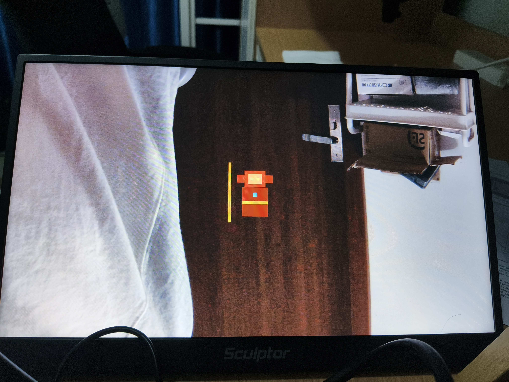
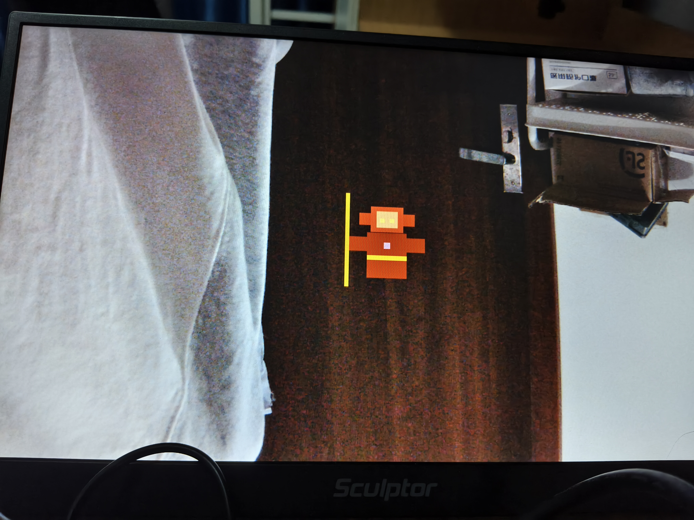

# Paper Puppet Art Direction Rework - 2026-08-06

## Board Acceptance Result

The v11 FPGA candidate is functionally closer to the requested direction: the
blue target is recognized and motion states are present. However, the current
HDMI artwork is **not accepted**.

The current rendering looks like a rigid red/orange block robot with a detached
straight line. A judge cannot identify it as Sun Wukong or as a Chinese
shadow-puppet character. The current pose geometry is too primitive and the
small debug marker is visually more obvious than the character.

Board photos:

## Previously Agreed Artistic Direction

The final effect is a **FPGA-rendered animated Sun Wukong paper-shadow-puppet**,
not a colored robot and not a generic rectangular avatar.

The physical paper target is only a recognition aid. The FPGA overlay should
replace the tracked target region with a recognizable virtual character:

- clear human/monkey silhouette,
- expressive monkey face,
- golden headband / crown shape,
- red-and-gold armor or robe blocks,
- visible shoulders, arms, legs, and a long golden staff,
- a compact cloud or ground accent if resources allow,
- strong black/gold outline so the character remains readable on HDMI.

The character may be stylized and geometrically simple, but it must read as
"Sun Wukong" at a glance. The current square head, rectangular torso, and
single detached line do not meet this requirement.

## Required Dynamic Actions

The motion plan agreed during design is a short connected animation, not one
static picture selected by a state bit:

1. **Idle / breathing**: slight body sway, cloth/staff movement, or small cloud
   motion. The character must not look frozen.
2. **Move left / move right**: body leans with the motion, feet/arms and staff
   follow the direction. Use at least two readable pose frames.
3. **Jump / fly**: body lifts, legs compress or separate, and a cloud/afterimage
   can appear for a short sequence.
4. **Fast sweep / attack**: the staff swings across the body with a visible
   preparation frame, attack frame, and recovery frame. Do not render only a
   detached vertical bar.
5. **Fire Eyes / 火眼金睛**: the right hand moves up toward the brow over several
   frames, then a long beam comes from the eyes. The beam should be visibly
   longer than the face and should fade or retract during recovery.

All actions need transitions such as:

`IDLE -> PREPARE -> ACTION -> RECOVER -> IDLE`

Do not switch between unrelated frozen poses in one frame.

## FPGA-Friendly Rendering Rule

Keep the implementation FPGA-friendly:

- use fixed geometric primitives and a small number of hard-coded pose frames,
- keep the existing blue-marker detection and v10A camera/HDMI baseline,
- anchor the character at the blue-marker center with fixed coordinate offsets,
- use a frame counter and a small FSM for interpolation/pose sequencing,
- do not require a full-frame bitmap or large external memory,
- keep the debug state marker behind a compile-time/test-mode switch or make it
  very small and unobtrusive in the final demo.

The artwork does not need photographic detail. It needs a strong silhouette,
recognizable cultural symbols, and visible motion.

## Required Communication Before Next Delivery

Before implementing another FPGA artwork revision, the FPGA-side author must
communicate with its board operator / art operator and explicitly confirm:

1. the Sun Wukong silhouette and color blocking,
2. the five action poses and their transitions,
3. the physical blue-marker placement relative to the character,
4. the final print/cut template and the HDMI preview.

Please attach a preview image or a small HTML/SVG comparison for approval before
packing the next JPSK. Do not independently simplify the character into a
robot again.

## Acceptance Criteria For The Next Board Version

- A viewer can identify Sun Wukong without being told what the shape is.
- The staff is attached to the hand/body composition and moves during attack.
- The character has at least a recognizable idle, movement, jump, and attack
  silhouette.
- Fire Eyes shows the hand-to-brow action and a long eye beam.
- The blue marker remains an internal tracking aid and does not dominate the
  final character artwork.
- v10A camera pass-through remains unchanged and stable before KEY2.