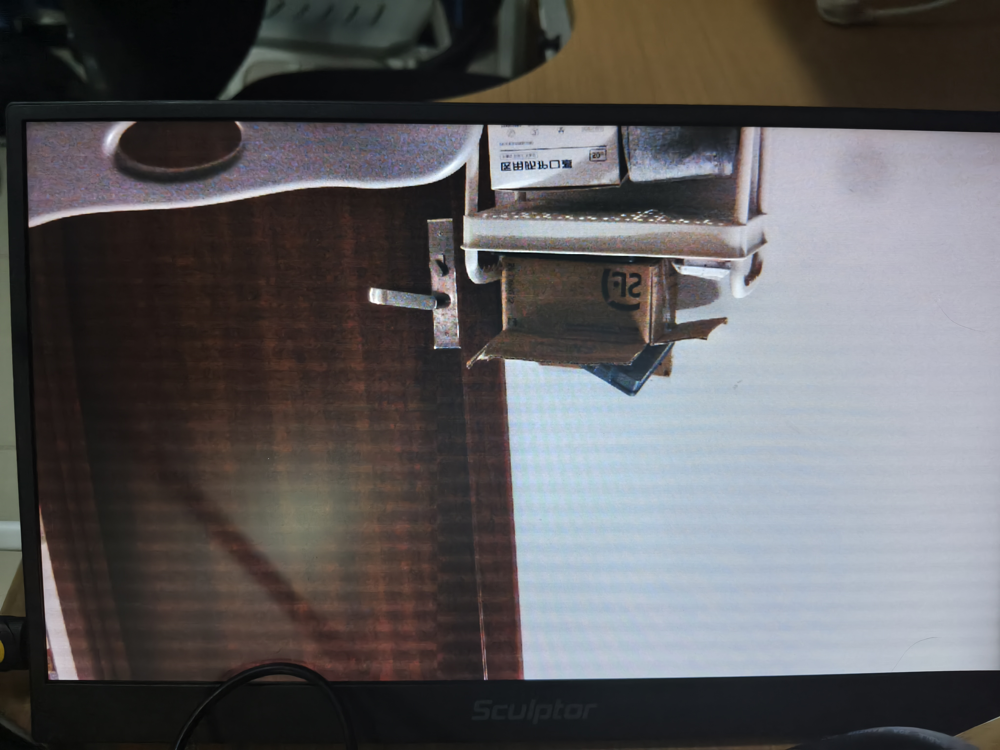

# Paper Puppet H6 Board Feedback - 2026-08-05

## Result

Current `dev/Fang_550W` delivery is not acceptable for the next board-test round.

Programming succeeds, but the default camera pass-through image is already broken before enabling the puppet overlay.

## Burned Candidate

- Branch observed: `dev/Fang_550W`
- Commit observed: `c4923af92d9ec76b392399472aa71bba4c28ed86`
- Delivery zip: `fpga工程_02/deliveries/PaperPuppet_H6_Standalone_VideoChain_20260805.zip`
- Program file burned:
  `01_FPGA/ov5640_hdmi_1080p.runs/imple_1/ov5640_hdmi_1080p.jpsk`
- JPSK SHA256 observed by board side:
  `0355DDDE969D8B7335E88E040769DA2A086EA4D25040005CF80547F30DFF84D7`
- Programmer result:
  `Successful: (No_11)JTAG down FPGA successful.`

## Observed Board Symptom

After programming, without pressing `KEY2`, the initial HDMI camera image is not a normal live pass-through image. The screen shows severe horizontal tearing/line streaks across almost the whole display.

Photo evidence:

## Interpretation

This is a baseline video-chain failure, not a puppet-overlay visual-quality problem.

The failure appears before puppet mode is enabled, so do not continue tuning the Sun Wukong overlay first. The next version must first restore the stable reference camera path.

## Required Fix Direction

1. Start from the known-stable H6/eLinx OV5640 -> SDRAM/video -> HDMI chain.
2. Keep default mode as exact camera pass-through.
3. Add the paper-puppet overlay only after the stable HDMI-domain RGB/DE/HS/VS path is already proven stable.
4. Do not alter the stable camera capture, SDRAM ping-pong, HDMI timing, PLL/reset, or DE/HS/VS alignment unless the change is explicitly required and documented.
5. If overlay insertion is needed, insert it as a purely combinational or HDMI-clock registered RGB replacement stage after the stable pixel stream is formed, while preserving original `de`, `hsync`, and `vsync` timing.

## Acceptance Gate For Next Delivery

The next candidate must pass this order:

1. Program `.jpsk` successfully.
2. Power/reset board.
3. Without pressing `KEY2`, HDMI shows live camera pass-through for at least 60 seconds.
4. Reject immediately if there is black screen, repeated horizontal tearing, unstable sync, persistent line streaks, or pixel displacement.
5. Only after default pass-through passes, press `KEY2` and test saturated-color paper target following.

## What To Return In The Next GitHub Delivery

- New standalone delivery zip.
- Exact commit hash.
- Exact `.jpsk` path and SHA256.
- A short note describing what stable video-chain source was used.
- A note confirming that default puppet enable is `0`.
- If any video-chain file was changed, list the file and why.

## v9 Delivery Note - 2026-08-05

The follow-up `PaperPuppet_H6_Standalone_VideoChain_20260805_v9.zip`
was downloaded from `dev/Fang_550W` commit
`08fce4ce9ed01dccbe8fe9a178f78a16c375ccc1`.

The package and its intended standalone JPSK hashes match the adjacent v9
README:

- ZIP SHA256:
  `D16E699449FF6C6DF9040122A531680C105E159EE153421BA9914A8CB0579A36`
- Intended standalone JPSK SHA256:
  `3813BD9CC9CC6CAFA5503FBD0019AAFE1DAF307B1C78B5EBFF86D73B606C4F6A`

Important packaging warning:

- Use only `01_FPGA/program_paper_puppet_jpsk.cmd` for this standalone v9
  candidate. It resolves to the local
  `ov5640_hdmi_1080p.runs/imple_1/ov5640_hdmi_1080p.jpsk`.
- Do not use `program_candidate_jpsk.cmd` or `program_unified_jpsk.cmd`.
  Both point to a different old total-project bitstream path under
  `01_FPGA/bitstreams/` and are not the v9 standalone PaperPuppet image.

## v9 Board Result - Improved But Still Failing

The v9 image was programmed successfully. The default camera pass-through is
much better than the first board candidate, but it still shows residual
horizontal striping/noise. This is still a default-pass-through failure; do not
start judging the paper-puppet overlay until this is clean.

Photo evidence:

Observed progression:

- First candidate: whole screen had severe horizontal tearing/line streaks.
- v9 candidate: image geometry is mostly usable, but fine horizontal stripe
  artifacts remain visible across the image.

## Local Difference Check Against Stable Reference

Compared with the known-stable reference project
`F:\codex\merge_20260723\GrayMedian_D_Work\01_FPGA`, these files are identical
in v9:

- `ov5640/ov5640_data.v`
- `ov5640/ov5640_top.v`
- `TOP1.v`
- `SDRAM/sdram_write.v`
- `SDRAM/sdram_read.v`
- `hdmi/video_display.v`
- `ov5640_hdmi_1080p.edc`

The meaningful differences found locally are concentrated in:

- `ov5640/ov5640_cfg.v`
  - Stable/reference and first candidate: `16'h3036 = 8'h54`
  - v9: `16'h3036 = 8'h48`
- `system/eth_video_rotate_system.v`
  - v9 adds PCLK-domain IO-local registers for `ov5640_vsync`,
    `ov5640_href`, and `ov5640_data`.
  - v9 bypasses unrelated merged optional engines in standalone mode.
  - v9 routes registered overlay timing through the final HDMI output pipeline.

This means the next fix should not broadly touch SDRAM, HDMI timing, or board
pin constraints. The current evidence points to the camera output clock / input
sampling margin area.

## Required v10 Strategy

Please produce small, labeled A/B candidates instead of one mixed change:

1. `v10A_input_reg_stable_3036_54`
   - Keep the v9 PCLK-domain IO-local input registers.
   - Keep the v9 standalone optional-engine bypass.
   - Restore `ov5640_cfg.v` register `3036` to the stable value `8'h54`.
   - Purpose: isolate whether v9's lower PCLK setting `8'h48` introduced the
     residual fine striping.

2. `v10B_input_reg_3036_48_phase_or_margin`
   - Keep `3036 = 8'h48`.
   - Only adjust the minimum necessary input timing/sampling-margin item.
   - Do not change SDRAM/HDMI/display timing files unless the exact reason is
     documented.

For each candidate, return:

- Exact zip name.
- Exact commit hash.
- Exact `.jpsk` path and SHA256.
- Which files changed from v9.
- One-line hypothesis for the change.

Acceptance remains unchanged: default camera pass-through must be clean and
stable for at least 60 seconds before `KEY2`/paper-puppet testing.
