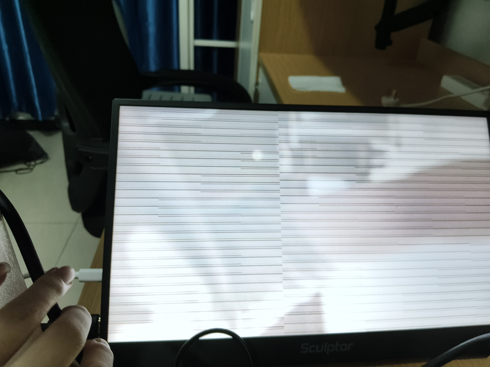

# Paper Puppet H6 Board Feedback - 2026-08-05

## Result

Current `dev/Fang_550W` delivery is not acceptable for the next board-test round.

Programming succeeds, but the default camera pass-through image is already broken before enabling the puppet overlay.

## Burned Candidate

- Branch observed: `dev/Fang_550W`
- Commit observed: `c4923af92d9ec76b392399472aa71bba4c28ed86`
- Delivery zip: `fpga工程_02/deliveries/PaperPuppet_H6_Standalone_VideoChain_20260805.zip`
- Program file burned:
  `01_FPGA/ov5640_hdmi_1080p.runs/imple_1/ov5640_hdmi_1080p.jpsk`
- JPSK SHA256 observed by board side:
  `0355DDDE969D8B7335E88E040769DA2A086EA4D25040005CF80547F30DFF84D7`
- Programmer result:
  `Successful: (No_11)JTAG down FPGA successful.`

## Observed Board Symptom

After programming, without pressing `KEY2`, the initial HDMI camera image is not a normal live pass-through image. The screen shows severe horizontal tearing/line streaks across almost the whole display.

Photo evidence:

## Interpretation

This is a baseline video-chain failure, not a puppet-overlay visual-quality problem.

The failure appears before puppet mode is enabled, so do not continue tuning the Sun Wukong overlay first. The next version must first restore the stable reference camera path.

## Required Fix Direction

1. Start from the known-stable H6/eLinx OV5640 -> SDRAM/video -> HDMI chain.
2. Keep default mode as exact camera pass-through.
3. Add the paper-puppet overlay only after the stable HDMI-domain RGB/DE/HS/VS path is already proven stable.
4. Do not alter the stable camera capture, SDRAM ping-pong, HDMI timing, PLL/reset, or DE/HS/VS alignment unless the change is explicitly required and documented.
5. If overlay insertion is needed, insert it as a purely combinational or HDMI-clock registered RGB replacement stage after the stable pixel stream is formed, while preserving original `de`, `hsync`, and `vsync` timing.

## Acceptance Gate For Next Delivery

The next candidate must pass this order:

1. Program `.jpsk` successfully.
2. Power/reset board.
3. Without pressing `KEY2`, HDMI shows live camera pass-through for at least 60 seconds.
4. Reject immediately if there is black screen, repeated horizontal tearing, unstable sync, persistent line streaks, or pixel displacement.
5. Only after default pass-through passes, press `KEY2` and test saturated-color paper target following.

## What To Return In The Next GitHub Delivery

- New standalone delivery zip.
- Exact commit hash.
- Exact `.jpsk` path and SHA256.
- A short note describing what stable video-chain source was used.
- A note confirming that default puppet enable is `0`.
- If any video-chain file was changed, list the file and why.

