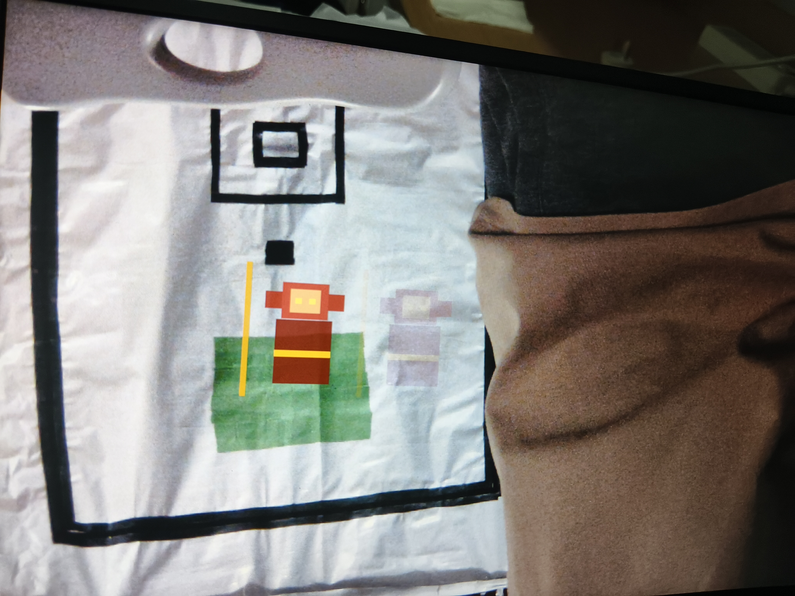

# Paper Puppet Board Feedback - Static Overlay, No Motion Yet - 2026-08-05

## Board Observation

The v10A camera pass-through is now stable enough for the next feature step.
After enabling the paper-puppet overlay, the HDMI output shows a fixed puppet
shape anchored near the detected target.

Board photo:

## Current Problem

The current effect is still a static drawing / static replacement overlay.
It does not yet look like a moving puppet or an animated action. The visible
result is close to "place one fixed sprite at the detected target center".

This is acceptable as a first bring-up milestone, but it is not enough for the
final demo. The next version needs motion states while keeping the v10A stable
camera path unchanged.

## Requested Next Version

Please keep the v10A video-chain stability fixes as the baseline:

- keep the stable OV5640 setting `3036 = 8'h54`,
- do not change the camera capture / SDRAM / HDMI timing unless absolutely
  necessary,
- implement animation mainly inside the paper-puppet overlay layer.

Add a small FPGA-side action state machine based on the tracked target center:

1. **Idle / static**: target nearly still. Puppet has a small breathing / cloth
   sway effect using a frame counter, not a completely frozen shape.
2. **Move left / move right**: horizontal target velocity changes body/staff
   offset or switches between 2 simple poses.
3. **Jump / fly**: fast upward motion triggers a short jump frame sequence.
4. **Sweep / attack**: fast horizontal sweep triggers staff / sleeve extension.
5. Optional: if implementation cost is low, add a short eye-beam or highlight
   effect triggered by a specific simple motion.

The action does not need complex artwork. Two or three hard-coded geometric
poses are enough, but HDMI must visibly change over time so judges can see that
it is not just a static overlay.

## Debug Visibility Request

For board testing, please provide one simple visible indicator when possible:

- draw a tiny colored dot at the detected target center, or
- draw a small state-color marker for Idle / Move / Jump / Attack.

This helps us tell whether failures come from target detection or from the
animation state machine.

## Physical Target Question Still Open

The hardware operator still needs a concrete physical puppet/marker design.
Please answer the previous target-design question with one recommended pattern:

- recommended color,
- marker shape and size,
- background color,
- whether to use a full-color puppet body or only a central color marker,
- forbidden features such as thin saturated limbs/staff that may pull the
  bounding-box center.

Based on the current RTL, our fallback guess is still: a large matte saturated
blue central marker on a white/light-gray background, with decorative puppet
art around it but not in the same saturated detection color.
## Printable Target Request

Please also provide one **printable recognition pattern** that the operator can
cut directly from paper:

- clear outer contour,
- obvious cut lines,
- easy-to-print colors,
- no tiny thin parts,
- suitable for A4 or similar paper.

We will use this as the physical puppet prototype, so the image should be
recognition-friendly first and decorative second.