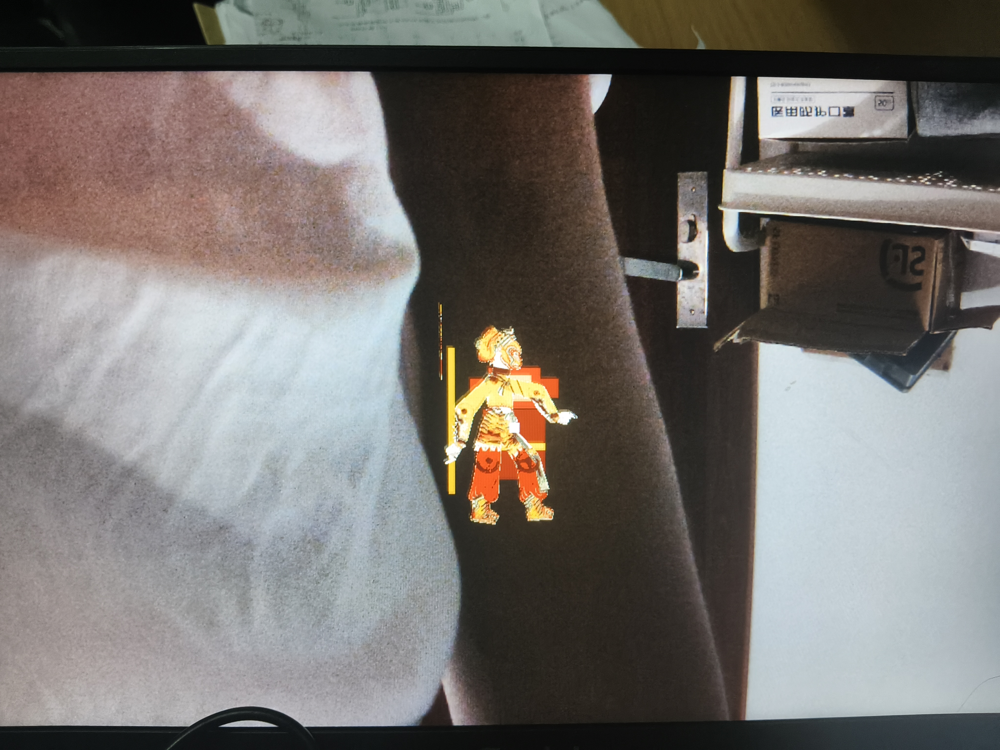

# Paper Puppet v12 Board Feedback - Block Layer Still Remains

## Board Observation

The v12 candidate improved the character art quality, but the visible HDMI
result is still wrong in two ways:

1. The old block-style monkey layer is still present behind or around the new
   Wukong sprite.
2. The animation still looks mostly static. The character is not yet
   performing clearly separated motion states.

Board photo:

## What Needs To Change

Please tell the FPGA author to do the following before the next release:

- Remove the legacy block monkey layer from the final visible composition.
- Do not blend the new sprite with the old rectangular body/head/ears/face
  geometry.
- Make the Wukong sprite the only visible character layer.
- Keep only the tiny debug marker if absolutely necessary.
- Drive the sprite with real action states, not a mostly static pose plus small
  offsets.

## Expected Motion Direction

The agreed direction is still:

- idle breathing / cloth sway,
- left/right movement,
- jump/fly,
- sweep/attack,
- fire-eyes with a clear hand-to-brow transition and a long beam.

If the current sprite ROM only stores one pose, then the next version should use
multiple pose frames or a small frame sequencer so the motion reads clearly on
HDMI.

## Summary For The Next Commit

The art direction should be:

**single recognizable Wukong silhouette + real action frames + no legacy block monkey overlay**

Please confirm this with the board operator before packaging the next JPSK.